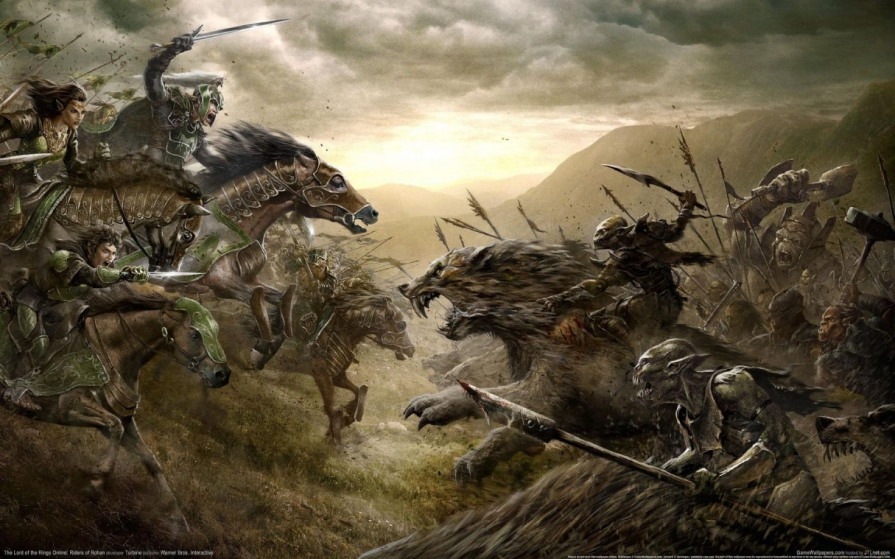

### FIT - Universidad Católica del Uruguay

 

# Encuentros de tipos en la Tierra Media

En este juego, los personajes han cobrado vida. Pero de una forma bastante desorganizada. 

Tenemos gran variedad de elementos que podemos intuír que son del mismo tipo. Pero esto no está reflejado en nuestro código. En este ejercicio vamos a modificar nuestro proyecto para mejorar el código que tenemos hasta ahora. 

## Personajes _[Characters]_

Quizás hayas notado que hay varias propiedades que los personajes tienen en común unos con otros. Todos ellos:

- manejan un nivel de vida

- pueden ser atacados

- pueden ser curados

- pueden tener items

Adicionalmente, los magos pueden tener elementos mágicos (a diferencia de los no-magos, que _no pueden tener elementos mágicos_). No olvides que los elementos mágicos también sirven para atacar y defender.

## Elementos _[Items]_

Existen muchos elementos, y podemos encontrar algunas cosas en común:

- Algunos elementos son armas, que le permiten a los personajes atacar a otros. Éstas tienen un valor de ataque.

- Otros elementos son de defensa y permiten defender ataques, y por ende tienen un valor de defensa.

- ¡Algunos permiten atacar **y** defender! En cuyos casos tienen valor de ataque y de defensa.

- Hay elementos que son mágicos y elementos que no. Esto es importante porque sólo los Magos pueden hacer uso de elementos mágicos.

- No existe solamente un hechizo, ¡existen muchos! Y el libro de hechizos puede tener muchos hechizos diferentes.

# Desafío

## Parte 0: Diseño

Construyan el diagrama de clases de la solución,agregando las abstracciones que identifiquen, dada
la descripción de elementos y personajes.

## Parte 1: Refactoring

Refactorizen1 el código de la [parte 1](https://github.com/ucudal/PII_RoleplayGame_1_Start),
aplicando las abstracciones que se identificaron en la parte anterior.

## Parte 2: Comprobar que sigue funcionando

Como bien saben, el proceso de refactoring cambia la estructura del código sin cambiar su comportamiento. Para demostrar esto, agreguen los casos de test de la [parte 1](https://github.com/ucudal/PII_RoleplayGame_1_Start#parte-4-testing) (o escribanlos si no llegaron a escribirlos) y comprueben que todo siga funcionando igual que antes (los tests dan verde).

*******

1 _«La refactorización (del inglés refactoring) es una técnica de la ingeniería de software para reestructurar un código fuente, alterando su estructura interna sin cambiar su comportamiento externo.» [Fuente](https://es.wikipedia.org/wiki/Refactorizaci%C3%B3n)_
